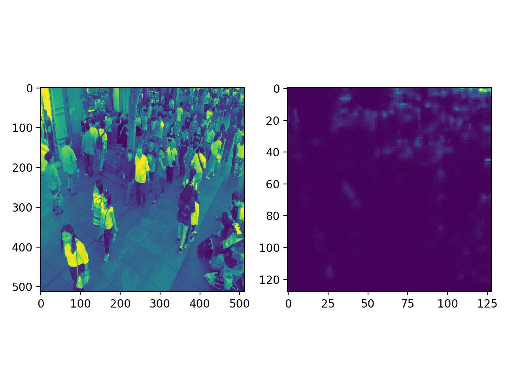

# Single Image Crowd Counting via Multi Column Convolutional Neural Network

This repository supply a TensorFlow implementation of CVPR2016 paper [Single Image Crowd Counting via Multi Column Convolutional Neural Network](https://www.cv-foundation.org/openaccess/content_cvpr_2016/papers/Zhang_Single-Image_Crowd_Counting_CVPR_2016_paper.pdf).

The code follow the design idea of this work [SSD-Tensorflow](https://github.com/balancap/SSD-Tensorflow), and some code are copied from there.

## Models
All the models are checked in logs/, i resized the input image into (512, 512, ?) and do NOT use pre-training strategy, here is the performance test from my side:

| model | training data | testing data | MAE | RMSE | notes |
|-------|:-------------:|:------------:|:---:|:---:|:-----:|
| model_v6 | shtech_part_B_train | shtech_part_B_test | 20.7 | 33.9 | using gray image as input |
| model_v102 | shtech_part_A_train | shtech_part_A_test | 111.9 | 178.0 | using RGB image as input |

## Example
```bash
python forecast.py --model_path=./logs/model_v6/model.ckpt-38941 --image_path=./testdata/crowd_count_89.jpg
```

And you will see(the ground truth is 89):

pred counts: 94.27829


NOTE: if your model use 3-channel image as input, you should change 'CHANNELS' to 3 in forecast.py.
